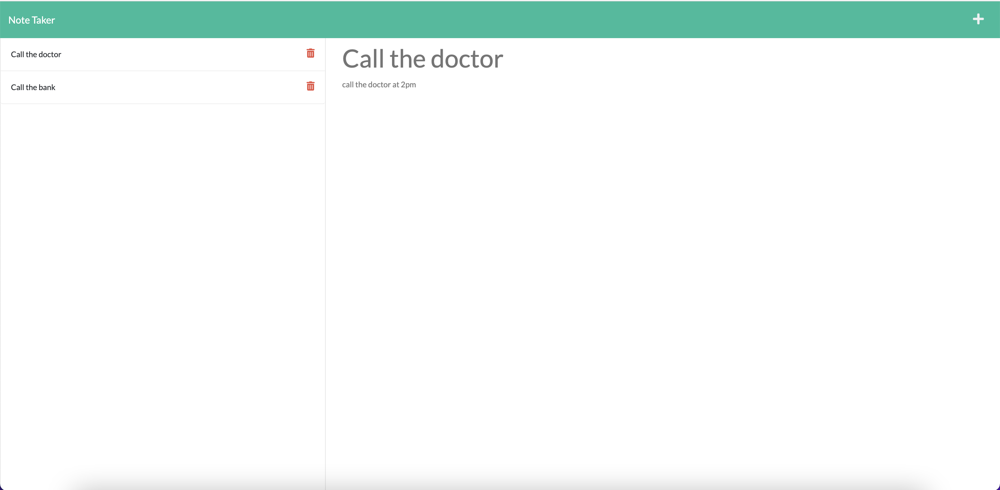

# Note Taker


## Description
This is a simple application that allows you to take notes. 


## Table of Contents
- [Note Taker](#note-taker)
  - [Description](#description)
  - [Table of Contents](#table-of-contents)
  - [Usage](#usage)
  - [Screenshot](#screenshot)
  - [Deployment](#deployment)
  - [Installation](#installation)
  - [Start the app](#start-the-app)
  - [Testing](#testing)
  - [Contributing](#contributing)
  - [License](#license)
  - [Questions](#questions)

## Usage
This is a Web application that allows you to take notes and save them to a to json file.
You can also delete notes at any time. 

## Screenshot


## Deployment
This application is deployed on Heroku.
[Live Link](https://note-taker-app-05.herokuapp.com/)

## Installation
```
git clone git@github.com:jimenezraul/my-note-taker-app.git
cd my-note-taker-app
npm install
```

## Start the app
```
npm start
```

## Testing
```
npm test
```

## Contributing
Raul

## License

This application is covered by the MIT license.

## Questions
Contact me by email or find me on github.  
GitHub: [jimenezraul](https://github.com/jimenezraul)  
Email: jimenezraul1981@gmail.com